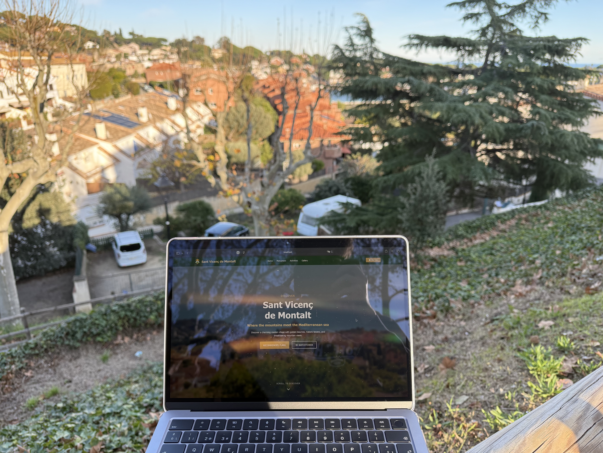

# Sant Vicenç Tourism Website

This project is a modern web application designed to promote tourism in Sant Vicenç de Montalt. It provides a comprehensive guide to local activities, cultural heritage, and a visual gallery, allowing visitors to explore the unique charm and Mediterranean atmosphere of the village. Built  for the multimedia final project.

## Live Demo
You can view the live website here:
**[GitHub Pages](https://justacoderlol.github.io/sant-vicenc-tourism/)**

## Detailed Documentation
Complete technical information, development process, and implemented features are detailed in the **report.pdf** file included in the project submission.

## Local Execution
To run the project on your local machine:
1. Install dependencies: `npm install`
2. Start the development server: `npm start`
3. Open [http://localhost:3000](http://localhost:3000) to view it in the browser.
